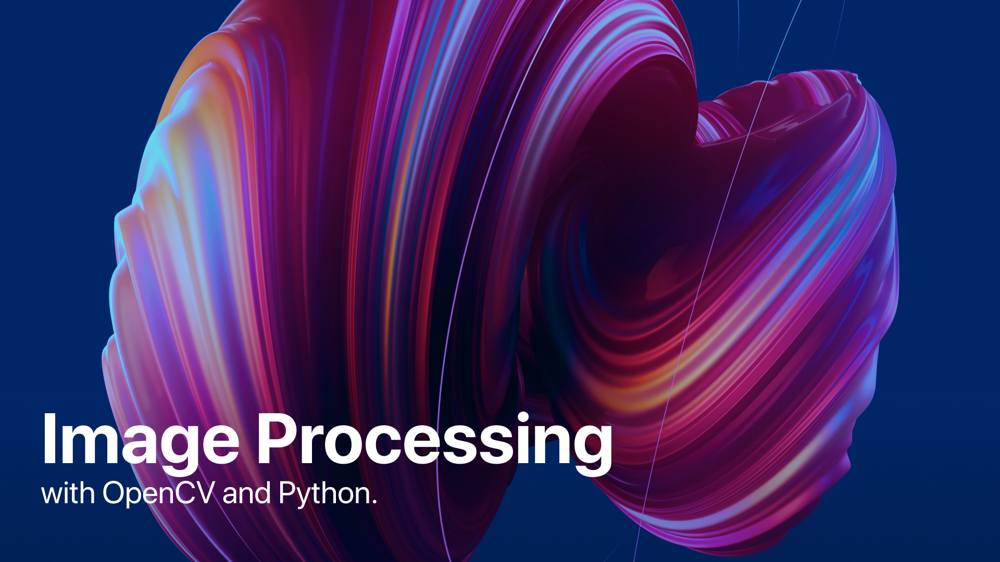

# NImgProcPy

Personal space dedicated to learning and experimenting with image processing using Python. 

## What's Inside:

### HW1 
Display the image in RGB Mode, Flip the image, Draw rectangle and triangle unfilled-filled

### HW2 
Convert image from BGR to various displaying option

### HW3
Displaying blended images

### HW4
Resize, remove the backgorund of watermark, blend on image

### HW5
Image thresholding

### HW6
Understand kernel size, how to noise reduction algorithm works

### HW7
Morphology, dilation and erosion, gradient

### Bitwise
Merge two rectangle by bitwise operator

### GIFLoading
Show GIF on specified window size by PyQt5, called function within other .py file

